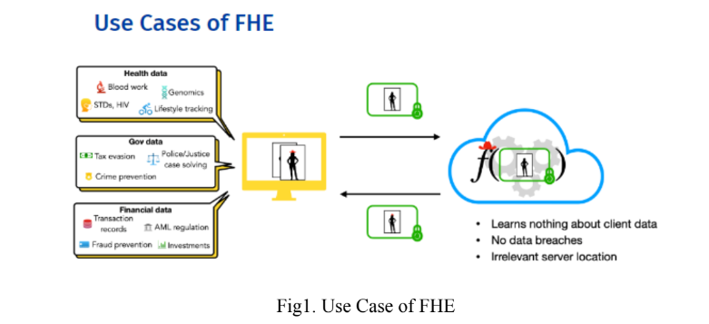
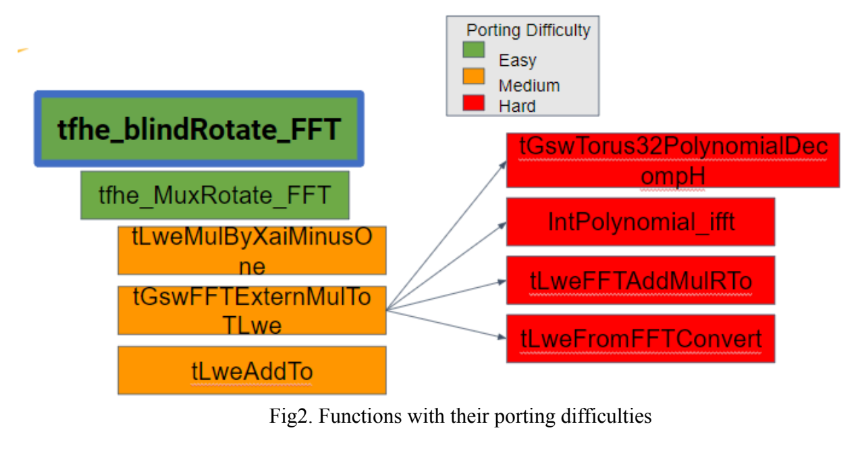

# FPGA Implementation of TFHE: Fully Homomorphic Encryption over the Torus

## Abstract
Fully Homomorphic Encryption (FHE) offers a revolutionary approach to secure data processing by allowing computations on encrypted data without requiring decryption. Among FHE schemes, TFHE is noted for its efficiency and adaptability. This project tackles the challenging translation of TFHE's C/C++ implementation into a form amenable for High-Level Synthesis (HLS) using Vivado HLS, targeting the powerful AMD/Xilinx Alveo U250 and U280 FPGA platforms.

## Introduction
In the digital era, where data privacy and security have become paramount, the demand for advanced encryption technologies has never been higher. Fully Homomorphic Encryption (FHE) stands at the forefront of this demand, offering a revolutionary solution that allows computations on encrypted data without the need to decrypt it first. Among the various FHE schemes, TFHE (Fully Homomorphic Encryption over the Torus) is particularly noted for its efficiency and adaptability, making it an attractive candidate for practical applications.



This project focuses on the FPGA (Field-Programmable Gate Array) implementation of TFHE. FPGAs, with their parallel processing capabilities and reconfigurability, provide an ideal platform for accelerating the computationally intensive operations inherent in homomorphic encryption algorithms. By translating TFHE's original C/C++ implementation into a form amenable for High-Level Synthesis (HLS) using Vivado HLS, this project aims to harness the power of AMD/Xilinx Alveo U250 and U280 FPGA platforms to significantly enhance TFHE's performance.

The move towards FPGA implementation of TFHE not only promises to reduce computation times drastically, making real-time secure data processing a reality but also opens up new possibilities for secure computing in cloud environments, healthcare, finance, and beyond. By addressing the challenges associated with dynamic memory allocation, complex data structures, and optimizing for FPGA acceleration, this project seeks to push the boundaries of what's possible with FHE, paving the way for its broader adoption in industry and academia.

Under the guidance of Prof. Philip Brisk, this project represents a significant step forward in the practical application of TFHE, demonstrating the feasibility and benefits of FPGA-based acceleration in the field of encryption technology.

## Related Work
The intersection of Fully Homomorphic Encryption (FHE) and Field-Programmable Gate Arrays (FPGAs) has seen growing interest as researchers strive to overcome the performance barriers traditionally associated with FHE. This project draws inspiration from seminal works in both domains to leverage the computational flexibility and efficiency of FPGAs for enhancing TFHE's performance.

- **Faster fully homomorphic encryption: Bootstrapping in less than 0.1 seconds** by Ilaria Chillotti, Nicolas Gama, Mariya Georgieva, and Malika Izabachène. This pivotal paper introduces TFHE, showcasing significant improvements in bootstrapping times, a critical operation in FHE schemes. The work's innovative use of the Torus structure and gate-by-gate bootstrapping presents a foundational approach for our FPGA implementation, aiming to further accelerate these operations through hardware optimization.

- **Optimizing FFT Resource Efficiency on FPGA using High-level Synthesis** by Guanglin Xu, Tze Meng Low, James C. Hoe, and Franz Franchetti. While focusing on Fast Fourier Transform (FFT) optimizations on FPGAs, this work highlights the potential of HLS tools in bridging the gap between high-level algorithmic design and low-level hardware implementation. By applying similar optimization strategies, our project aims to refine the FFT operations within TFHE, critical for both encryption and decryption processes, thus enhancing overall performance on FPGA platforms.

These works, among others, underscore the viability and necessity of exploring FPGA-based solutions for FHE, particularly TFHE. By combining TFHE's efficient encryption scheme with the parallel processing power and reconfigurability of FPGAs, this project contributes to the ongoing efforts to make secure, real-time computation on encrypted data a practical reality.

## Implementation
The core objective of this project is to convert the TFHE (Fast Fully Homomorphic Encryption over the Torus) library for FPGA deployment, focusing particularly on accelerating bootstrapping operations using High-Level Synthesis (HLS). This section delves into the specifics of implementing TFHE's algorithmic components on FPGA, highlighting the transition from software to hardware optimization and the employment of HLS tools to facilitate this process.

- **tfhe_blindRotate_FFT**: The entry point to the blind rotation operation, a complex procedure involving multiple dependent steps and intricate memory management, which makes it one of the more challenging parts to port.
- **tfhe_MuxRotate_FFT**: Calls upon `tLweMulByXaiMinusOne` and `tGswFFTExternMulToTLwe`, among other functions, to perform the bulk of the bootstrapping computations. Each function presents unique challenges in translating them efficiently into HLS-compatible operations.



Porting difficulties arise primarily from three aspects:

1. **Static Allocation**: FPGAs require all data structures to be statically allocated. This necessitates a departure from dynamic memory practices common in software implementations.
2. **Flattening Structures**: HLS is more efficient when complex structures involving pointers are flattened. This involves restructuring the C/C++ code to replace pointers with static arrays or directly embedded structures.
3. **Control Flow**: Given the inherent parallelism of FPGAs, control flow constructs common in software like loops and conditionals need to be carefully managed. Unrolling loops and ensuring conditional execution does not hinder parallelism is key.

- **Interface Synthesis**: In HLS, interface synthesis is the process by which high-level I/O commands are translated into specific hardware instructions that control how data moves in and out of the FPGA. A typical example is the use of `#pragma HLS INTERFACE` directives to bind function arguments to specific ports. This step is critical to ensure efficient data flow and can significantly impact the overall performance of the synthesized hardware.

Regarding the **IntPolynomial_ifft** function, which is responsible for the inverse FFT operation, we leveraged the Spiral FFT library for an equivalent and optimized FPGA implementation. The Spiral library was configured with the following parameters to match the requirements of the TFHE scheme:

```c
#define NPEASE 2048
#define Ri 2
#define SW 2
#define LOGrN 11
#define LOG2N 11
#define LOG2R 1
#define LOG2SW 1
#define LOG2_LOGrN 4
```
These settings align with the computational demands of TFHE, where the problem size needs to support 2048 elements with a radix of 2 and a streaming width of 2.

Finally, to verify the correctness of the ported implementation against the original TFHE library, extensive logging of intermediate inputs and outputs was integrated into the code. This was crucial for side-by-side comparisons and validation of the FPGA version's output against the trusted software version. Adjustments to header file paths were made to facilitate direct comparison and streamline the development process. The added logging statements helped to pinpoint inaccuracies and enabled iterative refinements to ensure that the FPGA implementation behaved identically to the original TFHE functions.

## Verification
The verification strategy for ensuring the reliability and correctness of the FPGA implementation of the TFHE library involves a methodical and rigorous comparison of outputs from HLS modules against those from the original TFHE library. Here's an overview of the approach:

- **Unit Testing of Individual Modules**: Each HLS-ported module is tested individually with a set of predefined inputs to verify its functionality. This unit testing phase checks for correctness at a granular level, ensuring that each building block of the algorithm performs as expected.
- **Test Vectors from TFHE Library**: Known-good output vectors (test vectors) are generated using the original TFHE library. These vectors serve as benchmarks for evaluating the HLS modules' performance.
- **Logging and Traceability**: Comprehensive logging mechanisms are integrated into both the HLS modules and the original TFHE library to capture intermediate results. This provides traceability and aids in debugging discrepancies between the two implementations.

By systematically applying this multi-level verification strategy, the FPGA implementation can be validated for correctness, ensuring that it can be reliably used for applications that require secure, homomorphic encryption.

## Future Scope
The future development of TFHE's FPGA implementation through High-Level Synthesis presents a multi-faceted opportunity for growth in areas such as advanced pipelining to achieve higher clock speeds and reduced latency, and resource sharing for a more efficient FPGA resource utilization. Exploring deeper levels of parallelism beyond loop unrolling, coupled with optimized memory access strategies, promises significant performance gains. Further, algorithmic enhancements, particularly tailored FFT implementations, and adaptive precision adjustments could yield computational and resource efficiency benefits. As quantum computing progresses, ensuring quantum resistance becomes imperative for maintaining long-term security. Integrating TFHE with other hardware accelerators could create a hybrid environment optimizing both speed and power, while broadening the scheme to encompass other cryptographic algorithms could vastly increase secure computation applications. Tools for automatic HLS code generation from high-level cryptographic specifications would lower implementation barriers, and advanced verification tools are essential to ensure security and correctness in cryptographic contexts. These directions collectively represent the roadmap for advancing TFHE FPGA implementations to meet emerging secure computation demands.

## Conclusion
In this project, we have successfully translated the TFHE library from C/C++ to an FPGA-amenable form using High-Level Synthesis (HLS) for the AMD/Xilinx Alveo U250 and U280 platforms. The transformation involved overcoming challenges related to dynamic memory allocation, complex data structures, and the inherently sequential nature of certain operations within TFHE. Our verification process confirmed the correctness of our implementation by comparing it against the original TFHE library's outputs, ensuring reliability for practical applications.

## References
1. I. Chillotti, N. Gama, M. Georgieva, and M. Izabachène. TFHE: Fast Fully Homomorphic Encryption over the Torus. In Journal of Cryptology, volume 33, pages 34–91 (2020).
2. I. Chillotti, N. Gama, M. Georgieva, and M. Izabachène. Faster fully homomorphic encryption: Bootstrapping in less than 0.1 seconds. In Asiacrypt 2016 (Best Paper), pages 3-33.
3. Xu, G., Low, T. M., Hoe, J. C., & Franchetti, F. Optimizing FFT Resource Efficiency on FPGA using High-level Synthesis. Department of Electrical and Computer Engineering, Carnegie Mellon University.

